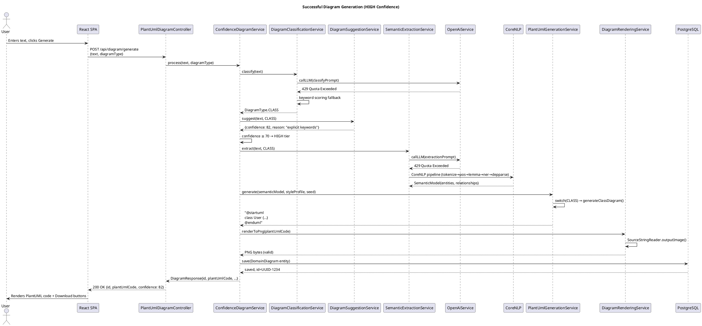
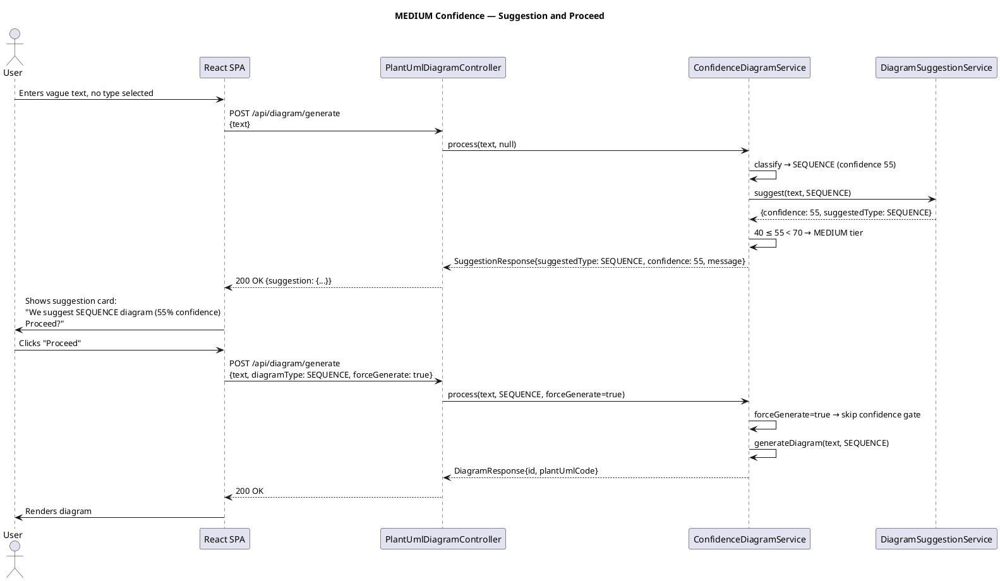
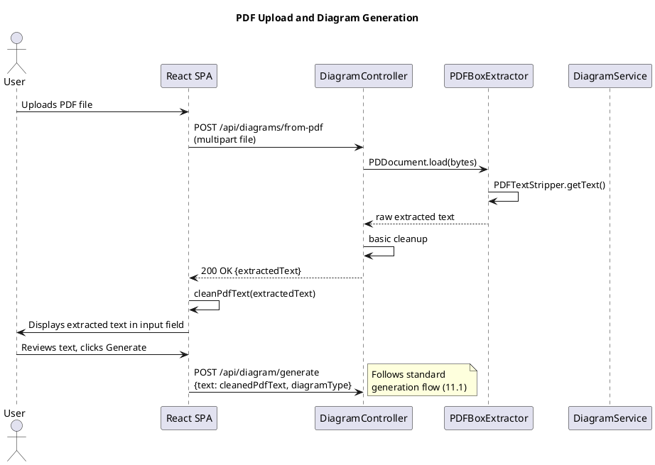
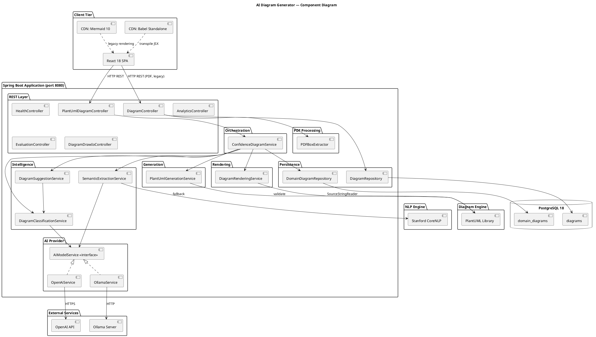
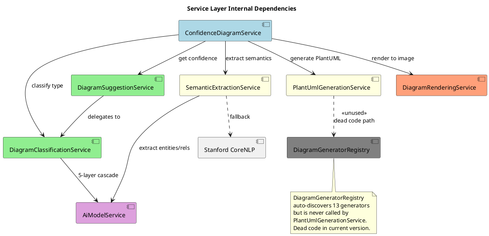
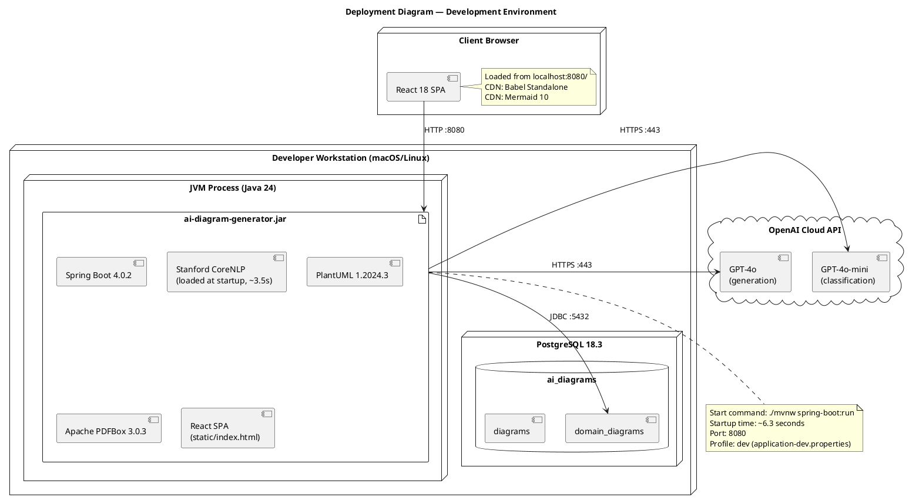
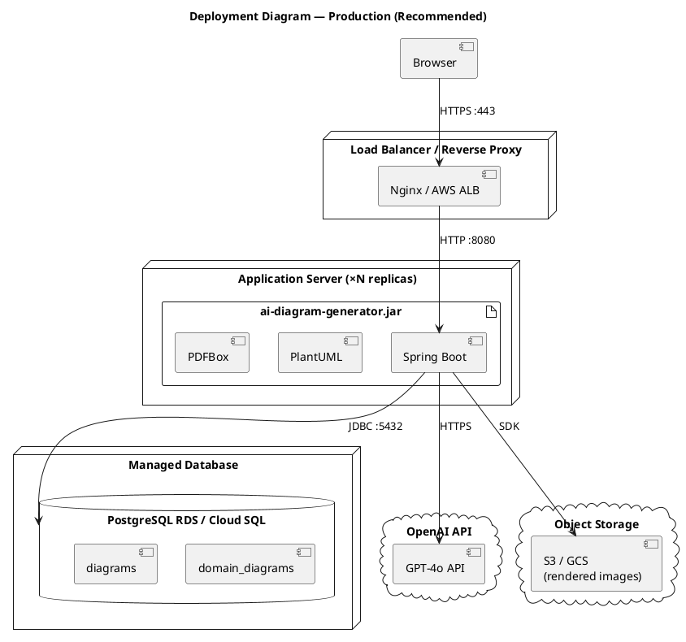
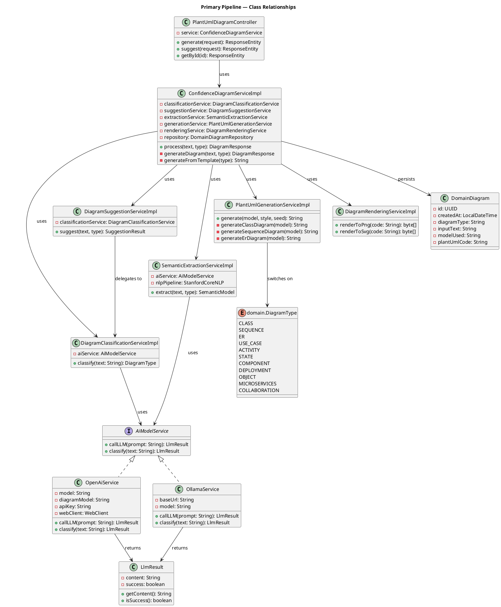
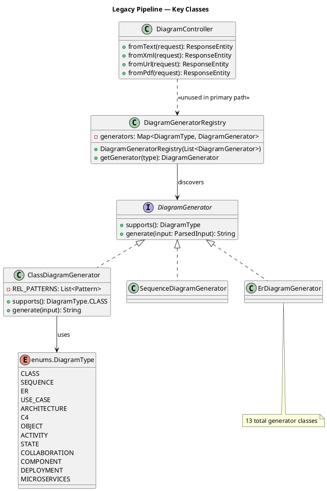

# AI Diagram Generator — Complete Technical Documentation
### University Capstone Defense Reference

**Project:** AI-Powered Diagram Generation System  
**Technology Stack:** Spring Boot 4.0.2 · Java 24 · PostgreSQL 18 · PlantUML 1.2024.3 · OpenAI GPT-4o · Stanford CoreNLP 4.5.7 · React 18  
**Date:** May 2026

---

## Table of Contents

1. [System Architecture Overview](#1-system-architecture-overview)
2. [Backend Flow](#2-backend-flow)
3. [Frontend Flow](#3-frontend-flow)
4. [Request Lifecycle](#4-request-lifecycle)
5. [AI Integration Flow](#5-ai-integration-flow)
6. [PlantUML Generation Flow](#6-plantuml-generation-flow)
7. [Rendering Flow](#7-rendering-flow)
8. [PDF Extraction Flow](#8-pdf-extraction-flow)
9. [Database Flow](#9-database-flow)
10. [Manual Mode vs Auto Mode](#10-manual-mode-vs-auto-mode)
11. [Sequence Diagrams of System Internals](#11-sequence-diagrams-of-system-internals)
12. [Component Diagrams](#12-component-diagrams)
13. [Deployment Diagram](#13-deployment-diagram)
14. [Class Relationship Overview](#14-class-relationship-overview)
15. [API Documentation](#15-api-documentation)
16. [Debugging Guide](#16-debugging-guide)
17. [Testing Methodology](#17-testing-methodology)
18. [Known Limitations](#18-known-limitations)
19. [Future Improvements](#19-future-improvements)

---

## 1. System Architecture Overview

### 1.1 High-Level Description

The AI Diagram Generator is a full-stack web application that accepts natural language descriptions, uploaded documents (PDF), or structured text and converts them into software architecture diagrams. It supports eleven diagram types — class, sequence, entity-relationship, use case, activity, state, component, deployment, object, microservices, and collaboration — rendered as PNG or SVG using PlantUML.

The system is structured as a **single Spring Boot monolith** exposing a REST API backend and serving a React 18 single-page application from the same process. Diagram intelligence is provided by a layered pipeline that combines OpenAI LLMs with Stanford CoreNLP as a local NLP fallback, ensuring the application continues to produce diagrams even when the external AI service is unavailable or rate-limited.

### 1.2 Architectural Tiers

```
┌─────────────────────────────────────────────────────────────┐
│                      Client Browser                          │
│  React 18 SPA (CDN Babel, CDN Mermaid 10, Inline Rendering) │
└─────────────────────────┬───────────────────────────────────┘
                          │  HTTP REST (port 8080)
┌─────────────────────────▼───────────────────────────────────┐
│                  Spring Boot 4.0.2 Monolith                  │
│  ┌────────────────┐  ┌────────────────┐  ┌───────────────┐  │
│  │  REST Layer    │  │  Service Layer │  │  AI Layer     │  │
│  │  6 Controllers │  │  ~43 Services  │  │  OpenAI/NLP   │  │
│  └────────┬───────┘  └───────┬────────┘  └───────┬───────┘  │
│           │                  │                    │          │
│  ┌────────▼──────────────────▼────────────────────▼───────┐ │
│  │                PlantUML Rendering Engine                │ │
│  │              (net.sourceforge.plantuml)                 │ │
│  └─────────────────────────────────────────────────────────┘ │
└─────────────────────────┬───────────────────────────────────┘
                          │  JDBC (HikariCP)
┌─────────────────────────▼───────────────────────────────────┐
│            PostgreSQL 18.3  (localhost:5432/ai_diagrams)     │
│    Table: domain_diagrams (UUID PK, PlantUML pipeline)       │
│    Table: diagrams          (UUID PK, legacy Mermaid pipeline)│
└─────────────────────────────────────────────────────────────┘
```

### 1.3 Two Parallel Pipelines

One of the most significant architectural facts of this system is the existence of **two independent, parallel diagram generation pipelines**:

| Aspect | PlantUML Pipeline (Primary) | Legacy Mermaid Pipeline |
|---|---|---|
| Entry endpoint | `POST /api/diagram/generate` | `POST /api/diagrams/from-text` |
| Controller | `PlantUmlDiagramController` | `DiagramController` |
| Core service | `ConfidenceDiagramServiceImpl` | `DiagramService` |
| Output format | PlantUML → PNG/SVG | Mermaid syntax (text) |
| Confidence logic | Three-tier (HIGH/MEDIUM/LOW) | None |
| AI service | `OpenAiService` | `OpenAiService` |
| DB table | `domain_diagrams` | `diagrams` |
| Status | **Active, primary** | Legacy, maintained |

The PlantUML pipeline is the actively developed primary path. The Mermaid pipeline remains for backward compatibility and handles specialized inputs (XML, URL, PDF).

### 1.4 Technology Stack Detail

| Component | Technology | Version | Purpose |
|---|---|---|---|
| Application Framework | Spring Boot | 4.0.2 | Core runtime, DI, web, JPA |
| Language | Java | 24.0.1 | JVM language |
| Build Tool | Apache Maven | 3.9+ (wrapper) | Dependency & build management |
| Primary AI | OpenAI API | GPT-4o / GPT-4o-mini | Diagram generation & classification |
| NLP Fallback | Stanford CoreNLP | 4.5.7 | Local semantic extraction |
| Diagram Rendering | PlantUML | 1.2024.3 | Text-to-image rendering |
| PDF Processing | Apache PDFBox | 3.0.3 | PDF text extraction |
| Database | PostgreSQL | 18.3 | Persistent diagram storage |
| ORM | Hibernate / Spring Data JPA | 7.2.1 | Database abstraction |
| Frontend | React 18 | CDN (Babel standalone) | SPA UI |
| API Documentation | Springdoc OpenAPI | 2.8.6 | Swagger UI at `/swagger-ui.html` |
| Reactive HTTP | Spring WebFlux | (included in Boot) | Non-blocking HTTP client |

---

## 2. Backend Flow

### 2.1 Package Structure

```
com.example.aidiagramgenerator/
├── AiDiagramGeneratorApplication.java   (main class)
├── ai/                                   (AI provider abstraction)
│   ├── AiModelService.java               (interface)
│   ├── OpenAiService.java                (OpenAI implementation)
│   ├── OllamaService.java                (Ollama implementation)
│   ├── AiServiceException.java
│   └── LlmResult.java
├── config/                               (Spring configuration)
│   ├── AiProviderConfig.java             (@Bean selection: openai/ollama)
│   └── ...
├── controller/                           (REST endpoints)
│   ├── PlantUmlDiagramController.java    (primary pipeline)
│   ├── DiagramController.java            (legacy pipeline)
│   ├── DiagramDrawIoController.java      (Draw.io export)
│   ├── AnalyticsController.java
│   ├── EvaluationController.java
│   └── HealthController.java
├── domain/                               (domain model)
│   └── DiagramType.java                  (11-value enum for primary pipeline)
├── dto/                                  (data transfer objects)
│   ├── request/
│   └── response/
├── entity/                               (JPA entities)
├── enums/                                (enums)
│   └── DiagramType.java                  (13-value enum for legacy pipeline)
├── exception/                            (exception types + handler)
│   └── GlobalExceptionHandler.java
├── repository/                           (Spring Data repositories)
└── service/                              (43+ service classes)
    ├── ConfidenceDiagramServiceImpl.java  (orchestrator, primary pipeline)
    ├── DiagramClassificationServiceImpl.java
    ├── DiagramSuggestionServiceImpl.java
    ├── SemanticExtractionServiceImpl.java
    ├── PlantUmlGenerationServiceImpl.java
    ├── export/                            (export utilities)
    ├── generation/                        (legacy generator registry)
    │   ├── DiagramGenerator.java          (Mermaid interface)
    │   ├── DiagramGeneratorRegistry.java  (auto-discovered, unused by primary)
    │   ├── generator/                     (13 Mermaid generators)
    │   └── ...
    └── render/
        └── DiagramRenderingServiceImpl.java
```

### 2.2 Service Layer Responsibilities

| Service | Responsibility |
|---|---|
| `ConfidenceDiagramServiceImpl` | Master orchestrator: classification → confidence → route |
| `DiagramClassificationServiceImpl` | 5-layer cascade to determine diagram type |
| `DiagramSuggestionServiceImpl` | Wraps classification, emits confidence score and reason |
| `SemanticExtractionServiceImpl` | Extracts entities/relationships from text (AI or NLP) |
| `PlantUmlGenerationServiceImpl` | Converts `SemanticModel` → PlantUML code string |
| `DiagramRenderingServiceImpl` | Compiles PlantUML string → PNG/SVG bytes |
| `OpenAiService` | HTTP calls to OpenAI API |
| `OllamaService` | HTTP calls to local Ollama server |

### 2.3 Exception Handling

All exceptions are centralized in `GlobalExceptionHandler.java`:

| Exception | HTTP Status |
|---|---|
| `DiagramNotFoundException` | 404 Not Found |
| `InvalidDiagramRequestException` | 400 Bad Request |
| `IllegalArgumentException` | 400 Bad Request |
| `HttpMessageNotReadableException` | 400 Bad Request |
| `MethodArgumentNotValidException` | 400 Bad Request |
| `DiagramGenerationException` | 500 Internal Server Error |
| `DiagramRenderingException` | 500 Internal Server Error |
| `NoResourceFoundException` | 404 Not Found |
| `Exception` (catch-all) | 500 Internal Server Error |

---

## 3. Frontend Flow

### 3.1 Technology

The entire frontend is delivered as a single file: `src/main/resources/static/index.html`. It is a React 18 single-page application loaded via CDN (Babel standalone transpiles JSX in-browser at runtime). No build step is required.

External CDN dependencies:
- **React 18** — component rendering
- **Babel Standalone** — JSX transpilation in browser
- **Mermaid 10** — legacy diagram rendering (pipeline visualization only)

### 3.2 Application State

The frontend manages the following React state variables:

| State Variable | Type | Purpose |
|---|---|---|
| `text` | `string` | User's natural language input |
| `diagramType` | `string` | Selected type from dropdown (12 options) |
| `selectedDemo` | `string` | Currently active demo example |
| `result` | `object` | Successful diagram response (id, plantUmlCode, etc.) |
| `suggestion` | `object` | MEDIUM-confidence suggestion response |
| `error` | `string` | Error message to display |
| `loading` | `boolean` | Main generate button spinner state |
| `pdfFile` | `File` | Uploaded PDF file reference |
| `pdfLoading` | `boolean` | PDF extraction spinner state |
| `showFullPdfText` | `boolean` | Toggle for PDF text preview truncation |

### 3.3 Diagram Types Supported in UI

The dropdown offers 12 options:
- Auto-detect, Class Diagram, Sequence Diagram, Entity-Relationship, Use Case Diagram, Activity Diagram, State Diagram, Component Diagram, Deployment Diagram, Object Diagram, Microservices Diagram, Collaboration Diagram

### 3.4 Demo Examples

35+ hardcoded demo examples are embedded in `DEMO_EXAMPLES` array, covering every diagram type. Users can select a demo to pre-fill the text input.

### 3.5 Key User Actions

```
User opens browser
        │
        ▼
 Enters text description ──────────────┐
        │                              │
        │              OR              │
        │                              ▼
        │              Clicks a demo example (pre-fills text)
        │
        ▼
 Selects diagram type (or leaves "Auto-detect")
        │
        ▼
 Clicks "Generate Diagram" button
        │
        ├── [SUGGEST returned] → UI shows suggestion card with Proceed/Cancel
        │         └── [Proceed] → handleProceed() → re-calls with forceGenerate=true
        │
        ├── [SUCCESS returned] → Renders PlantUML code + Download PNG/SVG buttons
        │
        └── [ERROR returned] → Displays error message

 OR

 Uploads PDF file
        │
        ▼
 handlePdfUpload() → POST /api/diagrams/from-pdf → extracts text
        │
        ▼
 Extracted text populates the input field → User proceeds to generate
```

### 3.6 Type Mapping

The frontend maps display names to backend enum strings via `mapTypeToEnum()`:

| Display Name | Enum Value Sent |
|---|---|
| Auto-detect | *(omitted)* |
| Class Diagram | `CLASS` |
| Sequence Diagram | `SEQUENCE` |
| Entity-Relationship | `ER` |
| Use Case Diagram | `USE_CASE` |
| Activity Diagram | `ACTIVITY` |
| State Diagram | `STATE` |
| Component Diagram | `COMPONENT` |
| Deployment Diagram | `DEPLOYMENT` |
| Object Diagram | `OBJECT` |
| Microservices Diagram | `MICROSERVICES` |
| Collaboration Diagram | `COLLABORATION` |

---

## 4. Request Lifecycle

### 4.1 End-to-End Flow (Primary PlantUML Pipeline)

The complete lifecycle of a `POST /api/diagram/generate` request:

```
1. HTTP Request arrives
   └─ Body: { text, diagramType?, forceGenerate? }

2. PlantUmlDiagramController.generate()
   └─ Validates input, maps diagramType string → domain.DiagramType enum
   └─ Calls ConfidenceDiagramServiceImpl.process()

3. ConfidenceDiagramServiceImpl.process()
   ├─ Step A: DiagramClassificationService.classify(text) → DiagramType
   ├─ Step B: DiagramSuggestionService.suggest(text, type) → confidence score
   ├─ Step C: Evaluate confidence tier
   │   ├─ HIGH (≥70%)  → generateDiagram(text, type)
   │   ├─ MEDIUM (40-69%) → return SUGGEST response (HTTP 422 by convention)
   │   └─ LOW (<40%)   → return REJECT response
   └─ Step D (if HIGH or forceGenerate): generateDiagram()

4. generateDiagram(text, diagramType)
   ├─ SemanticExtractionService.extract(text, type) → SemanticModel
   │   ├─ Try: OpenAI structured extraction
   │   └─ Fallback: Stanford CoreNLP NLP pipeline
   ├─ PlantUmlGenerationService.generate(SemanticModel, style, seed) → String
   └─ DiagramRenderingService.renderToPng(plantUmlCode) → validate

5. Persist to domain_diagrams table
   └─ id (UUID), plant_uml_code, diagram_type, input_text, model_used

6. HTTP Response
   └─ { id, plantUmlCode, diagramType, confidence, imageUrl }
```

### 4.2 Confidence Decision Logic

```
Confidence Score Bands:
  ┌────────────────────────────────────────────┐
  │  Score ≥ 70  │  HIGH    │  Generate diagram │
  │  40 ≤ s < 70 │  MEDIUM  │  Suggest / ask   │
  │  Score < 40  │  LOW     │  Reject request  │
  └────────────────────────────────────────────┘
```

When `forceGenerate=true` is included in the request body, the confidence gate is bypassed entirely and diagram generation proceeds regardless of score.

### 4.3 HTTP Status Codes in Practice

| Scenario | HTTP Status |
|---|---|
| Diagram successfully generated | 200 OK |
| MEDIUM confidence suggestion returned | 200 OK (body contains `suggestion` key) |
| Missing required fields | 400 Bad Request |
| Diagram ID not found | 404 Not Found |
| PlantUML syntax error from generator | 500 Internal Server Error |
| OpenAI API rate limit (caught, fallback used) | 200 OK (NLP fallback activates) |

---

## 5. AI Integration Flow

### 5.1 AI Provider Abstraction

The system uses a provider abstraction pattern:

```java
// AiModelService.java — common interface
interface AiModelService {
    LlmResult callLLM(String prompt);
    LlmResult classify(String text);
}

// Configured via application.properties:
// ai.provider=openai   → injects OpenAiService @Primary bean
// ai.provider=ollama   → injects OllamaService @Primary bean
```

`AiProviderConfig.java` reads the `ai.provider` property and conditionally creates the appropriate bean as `@Primary`.

### 5.2 OpenAI Service (OpenAiService.java)

Two OpenAI models are configured:

| Property | Default Value | Used For |
|---|---|---|
| `openai.model` | `gpt-4o-mini` | Classification, structured JSON responses |
| `openai.diagram.model` | `gpt-4o` | Full diagram generation |
| `openai.api.key` | (required) | Authorization header |

Two calling modes:
- **`callLLM(prompt)`** — plain text request/response; used for diagram generation
- **`classify(text)`** — requests a structured JSON response; used for type classification

`LlmResult` wraps the response and exposes `.getContent()` and `.isSuccess()`. On failure, `isSuccess()` returns false and the calling service falls back to NLP.

### 5.3 NLP Fallback (Stanford CoreNLP)

When OpenAI is unavailable (HTTP 429, timeout, network error, or disabled), `SemanticExtractionServiceImpl` falls back to a 5-stage Stanford CoreNLP pipeline:

```
Input Text
    │
    ▼
Stage 1: tokenize      — splits text into tokens
    │
    ▼
Stage 2: pos           — Part-of-Speech tagging (NOUN, VERB, etc.)
    │
    ▼
Stage 3: lemma         — reduces words to base forms
    │
    ▼
Stage 4: ner           — Named Entity Recognition (PERSON, ORG, etc.)
    │
    ▼
Stage 5: depparse      — Dependency parsing (subject/object relationships)
    │
    ▼
Entity extraction: CAPITALIZED_WORD_PATTERN + PASCAL_CASE_PATTERN detect class names
Relationship extraction: RELATIONSHIP_KEYWORDS (30+ entries) + MULTIPLICITY_PATTERNS (13 patterns)
Action verb detection: ACTION_VERBS set (for sequence/activity diagrams)
    │
    ▼
SemanticModel { entities[], relationships[], actions[] }
```

The CoreNLP model loads at application startup and takes approximately 3.5 seconds. All subsequent NLP calls use the pre-loaded model with negligible overhead.

### 5.4 Classification — 5-Layer Cascade

`DiagramClassificationServiceImpl` determines diagram type through five ordered layers:

```
Layer 1: EXPLICIT_TYPE_PATTERNS (28 compiled regex patterns)
  └─ e.g., "class diagram", "uml class", "entity relationship"
  └─ If matched → return immediately with score ~95-100

Layer 2: AI Structured JSON (OpenAI gpt-4o-mini)
  └─ Sends text, requests JSON { diagramType, confidence, reasoning }
  └─ If AI available and responds → parse result

Layer 3: Semantic Pattern Matching
  └─ SEMANTIC_CATEGORIES map: type → List<Pattern>
  └─ Scores each candidate type by pattern matches

Layer 4: Keyword Scoring
  └─ INTERACTION_VERBS, STRUCTURAL_WORDS, ER_INDICATORS,
     INFRASTRUCTURE_TERMS, COMPONENT_TERMS, USE_CASE_TERMS,
     ACTIVITY_TERMS, STATE_TERMS, OBJECT_TERMS,
     MICROSERVICES_TERMS, COLLABORATION_TERMS
  └─ Each term set contributes score to its diagram type

Layer 5: AI Plain Text Fallback
  └─ If all above fail → ask AI: "What type of diagram is this?"
  └─ Parse free-text response for type keywords
```

### 5.5 ER Diagram Confidence Boost

The system contains a special `ER_CONFIDENCE_BOOST = 30` constant. If the text contains any of the predefined `ER_SIGNAL_PHRASES` (phrases strongly indicating entity-relationship domain), the confidence score for ER diagrams is boosted by 30 points before tier evaluation.

---

## 6. PlantUML Generation Flow

### 6.1 Overview

Once a `SemanticModel` is produced (entities, relationships, actions), `PlantUmlGenerationServiceImpl` converts it to a PlantUML string. This service contains an 11-case switch statement dispatching to private generation methods based on `DiagramType`.

### 6.2 Dispatch Table

| Diagram Type | Generator Method | Layout-Aware? |
|---|---|---|
| CLASS | `generateClassDiagram()` | Yes (uses `LayoutProfile`) |
| SEQUENCE | `generateSequenceDiagram()` | Yes |
| ER | `generateErDiagram()` | Yes |
| USE_CASE | `generateUseCaseDiagram()` | Yes |
| COMPONENT | `generateComponentDiagram()` | Yes |
| DEPLOYMENT | `generateDeploymentDiagram()` | Yes |
| ACTIVITY | `generateActivityDiagram()` | No |
| STATE | `generateStateDiagram()` | No |
| OBJECT | `generateObjectDiagram()` | No |
| MICROSERVICES | `generateMicroservicesDiagram()` | No |
| COLLABORATION | `generateCollaborationDiagram()` | No |

### 6.3 Template Fallback

If the generation pipeline fails (SemanticModel is empty, NLP extracts nothing, etc.), the system falls back to `generateFromTemplate()`, which uses the `DEFAULT_TEMPLATES` map. This map contains a hardcoded minimal PlantUML template for each of the 11 diagram types, ensuring a valid response is always returned.

### 6.4 StyleProfile and LayoutProfile

Two profile objects are passed to `generate()`:
- **`StyleProfile`** — controls color scheme, font, line style
- **`LayoutProfile`** — controls direction, node spacing, grouping strategy

**Known Bug:** `LayoutProfile.Direction` is an enum, but `PlantUmlGenerationServiceImpl` compares it against a hardcoded string `"top to bottom direction"`. Because an enum value never equals a string in Java, the direction condition always evaluates to false, and the layout direction is never applied intentionally.

### 6.5 DIAGRAM_TYPE_ALIASES Map

The `ConfidenceDiagramServiceImpl` contains a 27-entry `DIAGRAM_TYPE_ALIASES` map that translates frontend strings (including common variations and typos) to internal `domain.DiagramType` enum values:

```
"class"           → CLASS
"uml"             → CLASS
"entity"          → ER
"erd"             → ER
"er diagram"      → ER
"flowchart"       → ACTIVITY
"flow"            → ACTIVITY
"state machine"   → STATE
"deployment"      → DEPLOYMENT
... (27 total entries)
```

---

## 7. Rendering Flow

### 7.1 DiagramRenderingServiceImpl

After a PlantUML string is generated, `DiagramRenderingServiceImpl` compiles it to binary image data using the native PlantUML library (`net.sourceforge.plantuml.SourceStringReader`).

### 7.2 Validation Steps

Before rendering, the service performs:

1. **Null/empty check** — rejects blank input
2. **`@start` prefix check** — PlantUML strings must begin with `@start` (e.g., `@startuml`, `@startgantt`)
3. **Output size check** — maximum rendered output is **10 MB**

### 7.3 Rendering Pipeline

```
PlantUML String (text)
        │
        ▼
 SourceStringReader (PlantUML library)
        │
        ▼
 FileFormat.PNG  ─── renderToPng() → byte[]
 FileFormat.SVG  ─── renderToSvg() → byte[]
        │
        ▼
 Stored in memory; served via GET /api/diagram/{id}/png or /svg
```

### 7.4 Error Classification

| Error Type | Cause |
|---|---|
| `INVALID_SYNTAX` | PlantUML cannot parse the generated code |
| `RENDERING_ERROR` | PlantUML parsed but failed to render |
| `OUTPUT_ERROR` | Output exceeded 10 MB or write failed |

All three map to `DiagramRenderingException`, which is caught by `GlobalExceptionHandler` and returned as HTTP 500.

---

## 8. PDF Extraction Flow

### 8.1 Entry Point

PDF upload is handled by `POST /api/diagrams/from-pdf` (legacy `DiagramController`).

### 8.2 Extraction Pipeline

```
Multipart PDF Upload
        │
        ▼
 Apache PDFBox 3.0.3 — PDDocument.load(bytes)
        │
        ▼
 PDFTextStripper.getText()
        │
        ▼
 Raw extracted text (may include headers, footers, noise)
        │
        ▼
 cleanPdfText() [frontend JavaScript]
   ├─ Collapses repeated whitespace
   ├─ Removes page numbers (pattern matching)
   ├─ Strips common header/footer artifacts
   └─ Normalizes line endings
        │
        ▼
 Text populated into input field
        │
        ▼
 User reviews and clicks "Generate Diagram"
        │
        ▼
 Standard PlantUML pipeline (Section 4)
```

### 8.3 Limitations

- PDF must contain selectable text (not scanned images/OCR)
- Heavily formatted PDFs (multi-column, tables) may produce garbled extraction
- Maximum file size governed by Spring's `spring.servlet.multipart.max-file-size` setting

---

## 9. Database Flow

### 9.1 Schema

Two tables exist (reflecting the two parallel pipelines):

**`domain_diagrams`** (primary PlantUML pipeline):
```sql
CREATE TABLE domain_diagrams (
    id           UUID PRIMARY KEY,
    created_at   TIMESTAMP,
    diagram_type VARCHAR(50) CHECK (diagram_type IN (
                   'CLASS','SEQUENCE','ER','USE_CASE','ACTIVITY',
                   'STATE','COMPONENT','DEPLOYMENT','OBJECT',
                   'MICROSERVICES','COLLABORATION','ARCHITECTURE','C4'
                 )),
    input_text   TEXT,
    model_used   VARCHAR(100),
    plant_uml_code TEXT
);
```

**`diagrams`** (legacy Mermaid pipeline):
```sql
CREATE TABLE diagrams (
    id           UUID PRIMARY KEY,
    created_at   TIMESTAMP,
    diagram_type VARCHAR(50),
    input_text   TEXT,
    mermaid_code TEXT
);
```

### 9.2 ORM Configuration

- **Hibernate** with `spring.jpa.hibernate.ddl-auto=update` — schema is auto-managed
- **Spring Data JPA** repositories provide CRUD without boilerplate
- **HikariCP** connection pool (Spring Boot default)
- Connection string: `jdbc:postgresql://localhost:5432/ai_diagrams`

### 9.3 Persistence Flow

```
generateDiagram() completes → PlantUML string produced
        │
        ▼
 DomainDiagram entity constructed
   { id = UUID.randomUUID(),
     createdAt = now(),
     diagramType = type.name(),
     inputText = original text,
     modelUsed = "openai-gpt4o" | "nlp-corenlp",
     plantUmlCode = generated string }
        │
        ▼
 DomainDiagramRepository.save(entity)
        │
        ▼
 ID returned in HTTP response
        │
        ▼
 Client uses GET /api/diagram/{id} to retrieve
 Client uses GET /api/diagram/{id}/png or /svg for image
```

### 9.4 Retrieval

Diagrams are retrieved by UUID. The `modelUsed` field records whether the diagram was produced by OpenAI or the NLP fallback, which is useful for analytics.

---

## 10. Manual Mode vs Auto Mode

### 10.1 Auto Mode (Auto-detect)

When the user selects "Auto-detect" (or omits `diagramType` from the API request), the system infers the diagram type automatically through the 5-layer classification cascade described in Section 5.4.

**Flow:**
```
No diagramType in request
        │
        ▼
 DiagramClassificationService.classify(text)
        │
        ▼
 5-layer cascade produces best-match DiagramType + confidence score
        │
        ▼
 Confidence tier evaluation (HIGH/MEDIUM/LOW)
        │
        ├── HIGH → generate with inferred type
        ├── MEDIUM → return suggestion to user
        └── LOW → reject with explanation
```

### 10.2 Manual Mode (User-specified type)

When the user explicitly selects a diagram type (e.g., "Class Diagram"), the type is sent in the request body and passed directly to the generation pipeline. The classification step is still run to compute a confidence score, but the user-specified type overrides the classifier's suggestion.

**Flow:**
```
diagramType = "CLASS" in request
        │
        ▼
 mapTypeToEnum() maps "CLASS" → domain.DiagramType.CLASS
        │
        ▼
 DiagramSuggestionService.suggest(text, CLASS) → confidence score
        │
        ▼
 Confidence check (unless forceGenerate=true, which skips the check)
        │
        ▼
 generateDiagram(text, CLASS)
```

### 10.3 Force Generate

Setting `forceGenerate: true` in the request bypasses the confidence gate entirely, allowing generation even when the system would normally reject or suggest an alternative type. This is what the frontend uses when the user clicks "Proceed Anyway" after receiving a MEDIUM confidence suggestion.

### 10.4 Comparison Table

| Aspect | Auto Mode | Manual Mode | Force Generate |
|---|---|---|---|
| Type determination | Classifier (5 layers) | User selection | User selection |
| Confidence check | Yes | Yes | **Skipped** |
| Best for | Exploratory use | Precise requirements | Override after suggestion |
| Classification runs? | Yes | Yes | Yes (but gate bypassed) |

---

## 11. Sequence Diagrams of System Internals

### 11.1 Main Request — Successful HIGH Confidence Generation



### 11.2 MEDIUM Confidence — Suggestion Flow



### 11.3 PDF Upload Flow



### 11.4 AI Classification — 5-Layer Cascade

```plantuml
@startuml
title DiagramClassificationService — 5-Layer Cascade

participant "DiagramClassificationService" as CLS
participant "OpenAiService" as AI
participant "Keyword Scorer" as KW

[-> CLS: classify(text)

CLS -> CLS: Layer 1: EXPLICIT_TYPE_PATTERNS\n(28 compiled regex patterns)
alt explicit pattern matched
    CLS --> [: DiagramType (confidence ~97)
end

CLS -> AI: Layer 2: classify(text)\nstructured JSON response
alt AI available
    AI --> CLS: {diagramType, confidence, reasoning}
    CLS --> [: DiagramType from AI
end

CLS -> CLS: Layer 3: SEMANTIC_CATEGORIES patterns\nScore each candidate type

CLS -> KW: Layer 4: keyword scoring\n(11 term sets × weights)
KW --> CLS: scored map {DiagramType → score}
alt any score > threshold
    CLS --> [: highest-scoring DiagramType
end

CLS -> AI: Layer 5: plain-text fallback\n"What diagram type is this?"
AI --> CLS: free text response
CLS -> CLS: parse type keywords from text
CLS --> [: DiagramType (or CLASS as default)
@enduml
```

---

## 12. Component Diagrams

### 12.1 Application Component Diagram



### 12.2 Service Dependency Component Diagram



---

## 13. Deployment Diagram



### 13.1 Production Deployment (Recommended)

For production, the recommended topology separates concerns:



---

## 14. Class Relationship Overview

### 14.1 Primary Pipeline Class Relationships



### 14.2 Legacy Pipeline Class Relationships



---

## 15. API Documentation

### 15.1 Primary PlantUML Pipeline

#### `POST /api/diagram/generate`

Generates a PlantUML diagram from natural language input.

**Request Body:**
```json
{
  "text": "A User logs in and the AuthService validates credentials",
  "diagramType": "SEQUENCE",
  "forceGenerate": false
}
```

| Field | Type | Required | Description |
|---|---|---|---|
| `text` | `string` | Yes | Natural language description |
| `diagramType` | `string` | No | One of the 11 enum values; omit for auto-detect |
| `forceGenerate` | `boolean` | No | Bypass confidence gate if true |

**Success Response (200 OK):**
```json
{
  "id": "550e8400-e29b-41d4-a716-446655440000",
  "plantUmlCode": "@startuml\n...\n@enduml",
  "diagramType": "SEQUENCE",
  "confidence": 82,
  "modelUsed": "nlp-corenlp",
  "imageUrl": "/api/diagram/550e8400.../png"
}
```

**Suggestion Response (200 OK, suggestion key present):**
```json
{
  "suggestion": {
    "suggestedType": "SEQUENCE",
    "confidence": 55,
    "message": "Your description appears to be a sequence diagram (55% confidence). Proceed?"
  }
}
```

**Error Responses:**

| Status | Scenario |
|---|---|
| 400 | Missing `text` field or invalid enum value |
| 500 | PlantUML rendering failure |

---

#### `POST /api/diagram/suggest`

Returns diagram type suggestion without generating a diagram.

**Request Body:** Same as `/generate`

**Response (200 OK):**
```json
{
  "suggestedType": "CLASS",
  "confidence": 88,
  "reason": "Explicit keyword 'class diagram' detected"
}
```

---

#### `GET /api/diagram/{id}`

Retrieves a previously generated diagram by UUID.

**Response (200 OK):**
```json
{
  "id": "550e8400-...",
  "plantUmlCode": "@startuml\n...",
  "diagramType": "CLASS",
  "inputText": "original text...",
  "createdAt": "2026-05-15T10:30:00"
}
```

---

#### `GET /api/diagram/{id}/png`

Downloads the rendered diagram as a PNG image.

**Response:** `image/png` binary  
**Headers:** `Content-Disposition: attachment; filename="diagram.png"`

---

#### `GET /api/diagram/{id}/svg`

Downloads the rendered diagram as an SVG image.

**Response:** `image/svg+xml` text

---

### 15.2 Legacy Pipeline Endpoints

#### `POST /api/diagrams/from-text`

Generates a Mermaid diagram from plain text (legacy pipeline).

#### `POST /api/diagrams/from-xml`

Generates a diagram from XML/structured input.

#### `POST /api/diagrams/from-url`

Fetches content from a URL and generates a diagram.

#### `POST /api/diagrams/from-pdf`

**Request:** `multipart/form-data` with `file` field containing PDF.

**Response:**
```json
{
  "extractedText": "The extracted content from the PDF...",
  "diagramCode": "@startuml\n...",
  "diagramType": "CLASS"
}
```

---

### 15.3 Supporting Endpoints

| Method | Path | Description |
|---|---|---|
| `GET` | `/api/health` | Health check — returns `{ status: "UP" }` |
| `GET` | `/api/analytics` | Usage statistics |
| `POST` | `/api/evaluate` | Runs evaluation against test dataset |
| `GET` | `/swagger-ui.html` | Interactive Swagger UI |
| `GET` | `/api-docs` | OpenAPI JSON specification |

### 15.4 Common Error Response Format

```json
{
  "timestamp": "2026-05-15T10:30:00",
  "status": 400,
  "error": "Bad Request",
  "message": "Field 'text' must not be blank",
  "path": "/api/diagram/generate"
}
```

---

## 16. Debugging Guide

### 16.1 Application Startup

**Starting the application:**
```bash
# From project root
./mvnw spring-boot:run

# With specific profile
./mvnw spring-boot:run -Dspring-boot.run.profiles=dev
```

**Expected startup sequence:**
```
[main] Stanford CoreNLP pipeline initializing...   (~3.5s)
[main] HikariPool initialized (PostgreSQL)
[main] Swagger UI available at: http://localhost:8080/swagger-ui.html
[main] Started AiDiagramGeneratorApplication in 6.3 seconds
```

**Startup fails — common causes:**

| Symptom | Cause | Fix |
|---|---|---|
| `Connection refused` to PostgreSQL | DB not running | `brew services start postgresql` |
| `PSQLException: database does not exist` | DB not created | `createdb ai_diagrams` |
| `Could not find model file` | CoreNLP models jar missing | Verify `stanford-corenlp-4.5.7-models` in Maven cache |
| `Port 8080 already in use` | Another process | `lsof -i :8080` and kill the process |

### 16.2 OpenAI 429 Rate Limiting

**Symptom:** All AI-assisted routes fall back to NLP heuristics. Log shows:
```
WARN  OpenAiService - OpenAI call failed (HTTP 429): Rate limit exceeded
INFO  SemanticExtractionService - Falling back to CoreNLP pipeline
```

**This is expected behavior.** The NLP fallback is intentionally designed to handle this case. The application continues to function; diagram quality may differ from AI-generated output.

**Resolution:**
1. Wait for OpenAI quota reset (monthly)
2. Upgrade OpenAI plan
3. Switch to Ollama: set `ai.provider=ollama` in `application.properties`

### 16.3 Diagram Generation Fails

**Check 1 — PlantUML syntax error:**
```
ERROR DiagramRenderingService - Invalid PlantUML syntax: [error details]
```
The generated PlantUML code is invalid. Check the `plantUmlCode` field in the response and validate it at [plantuml.com/plantuml/uml](https://www.plantuml.com/plantuml/uml).

**Check 2 — Empty SemanticModel:**
If NLP extracts nothing (e.g., input text is extremely short or generic), the generator falls back to `DEFAULT_TEMPLATES`. The diagram will be a generic template for the detected type.

**Check 3 — Diagram type mismatch:**
The `DIAGRAM_TYPE_ALIASES` map may not contain the string being sent. Check that the diagramType field exactly matches one of the 11 enum values.

### 16.4 Database Issues

**Check schema:**
```sql
\d domain_diagrams
```

**CHECK constraint violation:**
If you see `ERROR: value violates check constraint`, a diagram type string is being saved that is not in the allowed list. This was fixed by updating the constraint to include all 13 type strings.

**Reset schema (development only):**
```sql
DROP TABLE IF EXISTS domain_diagrams CASCADE;
DROP TABLE IF EXISTS diagrams CASCADE;
-- Restart app; Hibernate will recreate tables
```

### 16.5 Logging Configuration

Add to `application.properties` for verbose output:
```properties
logging.level.com.example.aidiagramgenerator=DEBUG
logging.level.org.hibernate.SQL=DEBUG
logging.level.org.hibernate.type.descriptor.sql=TRACE
```

### 16.6 API Testing

**Quick health check:**
```bash
curl http://localhost:8080/api/health
```

**Generate a class diagram:**
```bash
curl -X POST http://localhost:8080/api/diagram/generate \
  -H "Content-Type: application/json" \
  -d '{"text": "A User has many Orders. Each Order contains multiple OrderItems.", "diagramType": "CLASS"}'
```

**Force generate despite low confidence:**
```bash
curl -X POST http://localhost:8080/api/diagram/generate \
  -H "Content-Type: application/json" \
  -d '{"text": "something vague", "diagramType": "SEQUENCE", "forceGenerate": true}'
```

**Download PNG:**
```bash
curl -o diagram.png http://localhost:8080/api/diagram/{id}/png
```

Alternatively, use the Swagger UI at `http://localhost:8080/swagger-ui.html` for interactive testing.

---

## 17. Testing Methodology

### 17.1 Test Structure

```
src/test/java/com/example/aidiagramgenerator/
├── ai/                         (AI service tests)
├── controller/                 (REST layer integration tests)
├── enums/                      (enum validation tests)
└── service/
    ├── export/                 (export service tests)
    └── generation/             (generation pipeline tests)
```

### 17.2 Test Types

**Unit Tests (JUnit 5 + Mockito):**
Individual service methods are tested in isolation using Mockito mocks for dependencies. The AI layer is always mocked in unit tests to avoid external calls.

**Integration Tests (Spring Boot Test):**
`@SpringBootTest` loads the full application context. The test database uses H2 in-memory (`h2` runtime dependency in `pom.xml`) instead of PostgreSQL when running tests.

**Evaluation Tests:**
Three JSON datasets are provided in `src/test/resources/`:
- `evaluation-dataset.json` — general diagram classification accuracy
- `generation-evaluation-dataset.json` — generation quality evaluation
- `usecase-evaluation-dataset.json` — use case diagram specific evaluation

These datasets drive the `EvaluationController`'s endpoints, allowing batch accuracy measurement against known-good classifications.

### 17.3 Running Tests

```bash
# All tests
./mvnw test

# Specific test class
./mvnw test -Dtest=DiagramClassificationServiceTest

# Skip tests (build only)
./mvnw package -DskipTests

# Test with verbose output
./mvnw test -Dsurefire.useFile=false
```

The project also includes `run-tests.sh` and `test-api.sh` shell scripts for automated API-level testing.

### 17.4 Test Database Configuration

Tests use H2 in-memory database. This is configured in the test classpath properties and requires no external database to run the test suite. Hibernate's `ddl-auto=create-drop` is typically used for tests to ensure clean schema per test run.

### 17.5 Testing the AI Fallback Path

Since OpenAI is externally dependent, tests that exercise the full generation pipeline must either:
1. Mock `AiModelService` to return predetermined `LlmResult` objects
2. Configure the test context to use `ai.provider=ollama` with a local Ollama instance
3. Test the NLP path directly by injecting `SemanticExtractionService` with a mocked `AiModelService` that returns `isSuccess() = false`

---

## 18. Known Limitations

### 18.1 Architectural Limitations

**1. Two Separate DiagramType Enums**
- `domain.DiagramType` (11 values) is used by the primary PlantUML pipeline
- `enums.DiagramType` (13 values, adds ARCHITECTURE and C4) is used by the legacy pipeline
- These are not interchangeable; passing one where the other is expected causes `ClassCastException`
- The `DiagramGeneratorRegistry` uses `enums.DiagramType` but the primary `PlantUmlGenerationServiceImpl` uses `domain.DiagramType`, making the registry incompatible with the primary pipeline

**2. Dead Code: DiagramGeneratorRegistry**
`DiagramGeneratorRegistry` auto-discovers 13 `DiagramGenerator` implementations, but `PlantUmlGenerationServiceImpl` never calls the registry. All generation is handled by private methods within `PlantUmlGenerationServiceImpl`. The 13 generator classes and the registry are unused in the primary pipeline.

**3. Dead Code: 6 DiagramGeneratorServiceImpl Classes**
Six service implementation classes follow the naming pattern `*DiagramGeneratorServiceImpl` and are never injected anywhere in the application context. They represent an abandoned refactoring and constitute dead code.

**4. LayoutProfile Direction Bug**
`LayoutProfile.Direction` is a Java enum, but `PlantUmlGenerationServiceImpl` compares it against a hardcoded string:
```java
if (layout.getDirection().equals("top to bottom direction")) // always false
```
Because an enum instance never equals a `String`, the layout direction condition is permanently false. Diagram layout direction is never intentionally controlled; any directional variation in generated diagrams is effectively random.

**5. SemanticExtraction Always Sends Class-Diagram Prompt**
`SemanticExtractionServiceImpl` sends an OpenAI prompt formatted for class diagram extraction regardless of the actual `diagramType` parameter. A sequence diagram request receives the same entity/relationship extraction prompt as a class diagram request. This reduces extraction quality for non-class diagram types.

### 18.2 Coverage Limitations

**6. DiagramSuggestionService Covers Only 6 of 11 Types**
`DiagramSuggestionServiceImpl.SEMANTIC_CATEGORIES` and `KEYWORD_SETS` contain entries only for:
- CLASS, ER, SEQUENCE, USE_CASE, COMPONENT, DEPLOYMENT

ACTIVITY, STATE, OBJECT, MICROSERVICES, and COLLABORATION have no semantic pattern entries. Classification for these types relies entirely on the AI layer (which is quota-limited) or generic keyword scoring, reducing suggestion accuracy.

### 18.3 Operational Limitations

**7. OpenAI API Quota**
The application is currently configured with an OpenAI API key that has exceeded its monthly quota. All AI calls return HTTP 429, causing the system to operate exclusively on NLP heuristics. This reduces diagram quality (especially for complex or ambiguous inputs) and eliminates AI-assisted classification accuracy from layers 2 and 5 of the cascade.

**8. No Timeout on REST Client**
`AiProviderConfig.java` creates a `RestClient` without any timeout configuration. A hanging OpenAI request will block the processing thread indefinitely, potentially causing thread pool exhaustion under load.

**9. Single JVM Process**
The monolithic architecture means PlantUML rendering (CPU-intensive) and Stanford CoreNLP NLP (memory-intensive) compete for the same JVM resources. Under concurrent load, latency increases significantly.

**10. No Caching**
Identical or near-identical inputs always trigger the full classification + extraction + generation pipeline. There is no result caching layer.

### 18.4 Data Limitations

**11. PDF Text-Only**
PDFBox extracts only selectable text. Scanned PDF documents (image-based) produce empty or garbage output. There is no OCR fallback.

**12. No Input Length Limiting**
Very long inputs (e.g., pasting an entire PDF's text) are passed to OpenAI and Stanford CoreNLP without truncation. This may cause OpenAI context length errors or slow NLP processing.

---

## 19. Future Improvements

### 19.1 Critical Fixes (High Priority)

| # | Issue | Recommended Fix |
|---|---|---|
| 1 | Two `DiagramType` enums | Consolidate into a single enum with all 13 values; update all references |
| 2 | `DiagramGeneratorRegistry` never used | Wire it into `PlantUmlGenerationServiceImpl` or delete it |
| 3 | `LayoutProfile.Direction` string comparison | Fix to `layout.getDirection() == LayoutProfile.Direction.TOP_TO_BOTTOM` |
| 4 | `SemanticExtractionService` always uses class-diagram prompt | Build per-type extraction prompts; dispatch based on `diagramType` parameter |
| 5 | `DiagramSuggestionService` missing 5 types | Add `SEMANTIC_CATEGORIES` and `KEYWORD_SETS` entries for all 11 types |
| 6 | Dead service implementations | Remove 6 unused `*DiagramGeneratorServiceImpl` classes |

### 19.2 Architecture Improvements (Medium Priority)

**Unify the Two Pipelines**
The legacy Mermaid pipeline and the primary PlantUML pipeline should be merged. Mermaid endpoints can be retained for backward compatibility but should share the same classification and extraction infrastructure.

**Add REST Client Timeouts**
```java
RestClient.builder()
    .requestFactory(new HttpComponentsClientHttpRequestFactory(
        HttpClientBuilder.create()
            .setDefaultRequestConfig(RequestConfig.custom()
                .setConnectTimeout(5, TimeUnit.SECONDS)
                .setResponseTimeout(30, TimeUnit.SECONDS)
                .build())
            .build()))
    .build();
```

**Result Caching**
Implement a cache (e.g., Spring Cache with Redis or Caffeine) keyed on `hash(text + diagramType)`. Classification and extraction results should be cached separately from rendered images.

**Async Generation**
Long-running diagram generation should be made asynchronous. The API should return a job ID immediately (`202 Accepted`) and expose a polling endpoint for completion status.

### 19.3 AI Integration Improvements

**Per-Type Extraction Prompts**
Design a dedicated system prompt and entity extraction schema for each of the 11 diagram types:
- Sequence diagrams: extract actors, messages, order, conditionals
- ER diagrams: extract entities, attributes, cardinalities, foreign keys
- Activity diagrams: extract actions, decisions, forks, joins, swimlanes

**Model Selection by Task**
- Classification: GPT-4o-mini (fast, cheap, accurate for classification)
- Semantic extraction: GPT-4o (richer context understanding)
- Template enhancement: GPT-4o-mini with few-shot examples

**Ollama Support for Local Development**
Ensure Ollama integration is fully functional with at least `llama3` and `mistral` models. This eliminates dependency on OpenAI quota for development and testing.

### 19.4 Feature Improvements

**Diagram Versioning**
Maintain a history of revisions for each diagram. Allow users to view previous versions, diff PlantUML code, and restore older versions.

**Collaborative Editing**
Add WebSocket support for real-time collaborative diagram editing, with PlantUML code synchronized across browser sessions.

**Export to Additional Formats**
- Draw.io XML (partial implementation exists in `DiagramDrawIoController`)
- Lucidchart import format
- PUML source download
- PDF with embedded metadata

**User Accounts and Diagram Library**
Add Spring Security with JWT authentication. Associate diagrams with user accounts. Provide a personal diagram library with search, tagging, and folder organization.

**Natural Language Diagram Editing**
Allow follow-up requests: "Add a payment step between Checkout and Confirmation" — interpret as a delta edit on the existing diagram rather than a full regeneration.

**PlantUML Code Editor**
Expose the raw PlantUML code in the UI with a syntax-highlighted editor (e.g., CodeMirror). Allow manual editing with live preview rendering.

### 19.5 Operational Improvements

**Health Check Enhancement**
Expand the `/api/health` endpoint to check:
- PostgreSQL connectivity
- OpenAI API reachability and quota status
- CoreNLP model load status

**Metrics and Observability**
Integrate Micrometer with Prometheus/Grafana:
- Request throughput per diagram type
- AI vs. NLP fallback ratio
- Generation latency percentiles
- Rendering failure rate

**Container Deployment**
Dockerize the application:
```dockerfile
FROM eclipse-temurin:24-jre
COPY target/*.jar app.jar
EXPOSE 8080
ENTRYPOINT ["java", "-jar", "/app.jar"]
```

Provide `docker-compose.yml` with PostgreSQL service for zero-configuration local development.

**Environment-Based Configuration**
Move all secrets and environment-specific values to environment variables:
- `OPENAI_API_KEY`
- `SPRING_DATASOURCE_URL`
- `SPRING_DATASOURCE_PASSWORD`

**CI/CD Pipeline**
Add GitHub Actions (or equivalent) workflow:
1. Compile and run tests
2. Static analysis (SpotBugs, PMD)
3. Build Docker image
4. Deploy to staging
5. Run integration test suite against staging

---

## Appendix A — Configuration Reference

**`application.properties` (key settings):**
```properties
# Database
spring.datasource.url=jdbc:postgresql://localhost:5432/ai_diagrams
spring.datasource.username=postgres
spring.datasource.password=

# JPA
spring.jpa.hibernate.ddl-auto=update
spring.jpa.show-sql=false

# AI Provider
ai.provider=openai
openai.model=gpt-4o-mini
openai.diagram.model=gpt-4o
openai.api.key=${OPENAI_API_KEY}

# Swagger
springdoc.swagger-ui.path=/swagger-ui.html
springdoc.api-docs.path=/api-docs

# Multipart (for PDF upload)
spring.servlet.multipart.max-file-size=50MB
spring.servlet.multipart.max-request-size=50MB
```

---

## Appendix B — Diagram Type Reference

| Enum Value | Use Case | Primary Keywords |
|---|---|---|
| `CLASS` | OOP class structure | class, extends, implements, inheritance, interface |
| `SEQUENCE` | Time-ordered interactions | calls, sends, requests, responds, returns |
| `ER` | Database schema | entity, table, foreign key, one-to-many, has |
| `USE_CASE` | System actor interactions | user can, actor, system allows, feature |
| `ACTIVITY` | Process/workflow steps | flow, process, step, decision, branch |
| `STATE` | Object state machine | state, transition, event, changes to |
| `COMPONENT` | Software modules | component, module, service, depends on, interfaces |
| `DEPLOYMENT` | Infrastructure topology | server, deploys to, hosts, node, container |
| `OBJECT` | Runtime object instances | instance, object, value, property |
| `MICROSERVICES` | Distributed services | microservice, API gateway, message queue, event |
| `COLLABORATION` | Agent cooperation | collaborates, communicates, coordinates |

---

## Appendix C — Glossary

| Term | Definition |
|---|---|
| PlantUML | Open-source tool for creating UML diagrams from plain text descriptions |
| SemanticModel | Internal data structure holding extracted entities and relationships |
| Confidence Tier | HIGH/MEDIUM/LOW classification based on the 70/40 confidence score thresholds |
| NLP Fallback | Stanford CoreNLP pipeline activated when OpenAI is unavailable |
| DiagramGeneratorRegistry | Spring-managed registry of Mermaid diagram generators (currently unused by primary pipeline) |
| DEFAULT_TEMPLATES | Hardcoded minimal PlantUML strings for each diagram type, used when generation fails |
| ER_CONFIDENCE_BOOST | +30 point bonus applied to ER diagram confidence when ER signal phrases are detected |
| forceGenerate | Request parameter that bypasses the confidence gate |
| DIAGRAM_TYPE_ALIASES | 27-entry map translating frontend strings to internal DiagramType enum values |
| CoreNLP Pipeline | 5-stage NLP process: tokenize → POS → lemma → NER → dependency parse |
