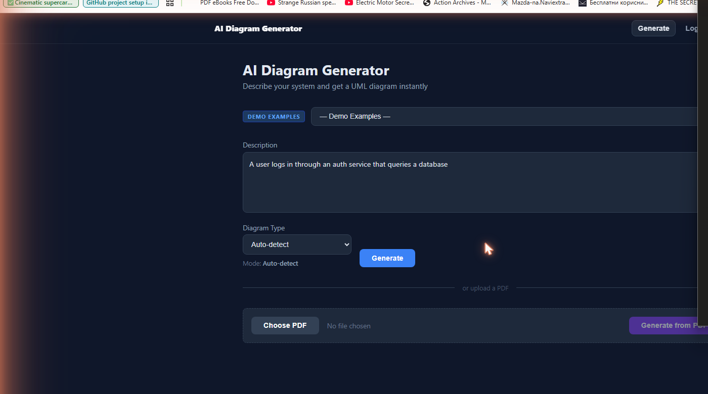
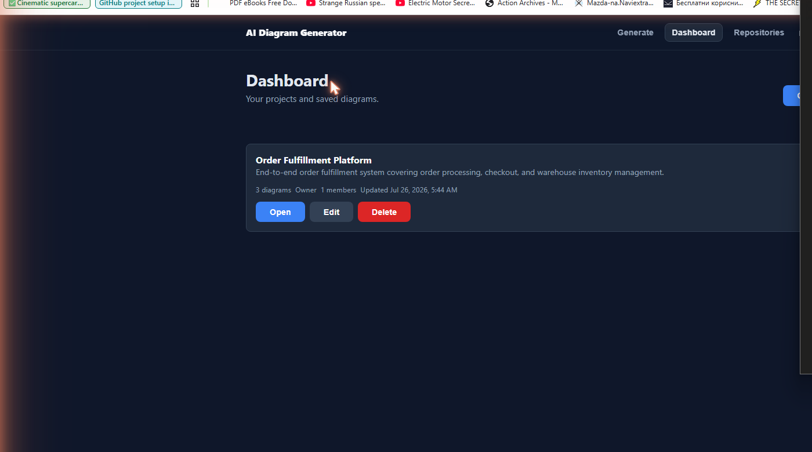
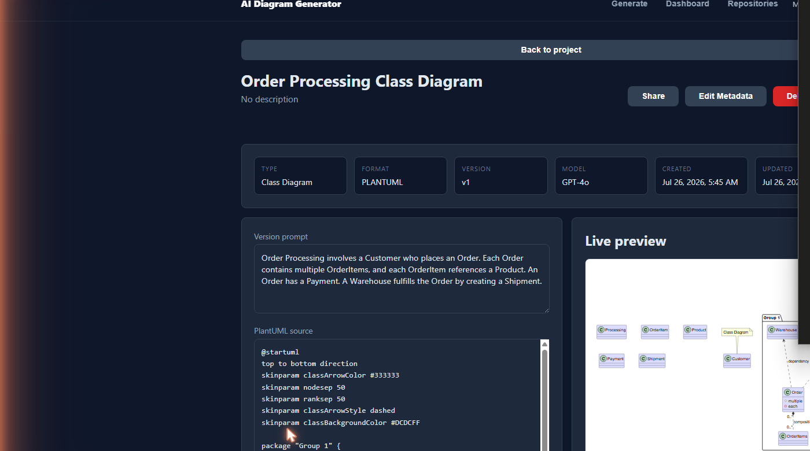
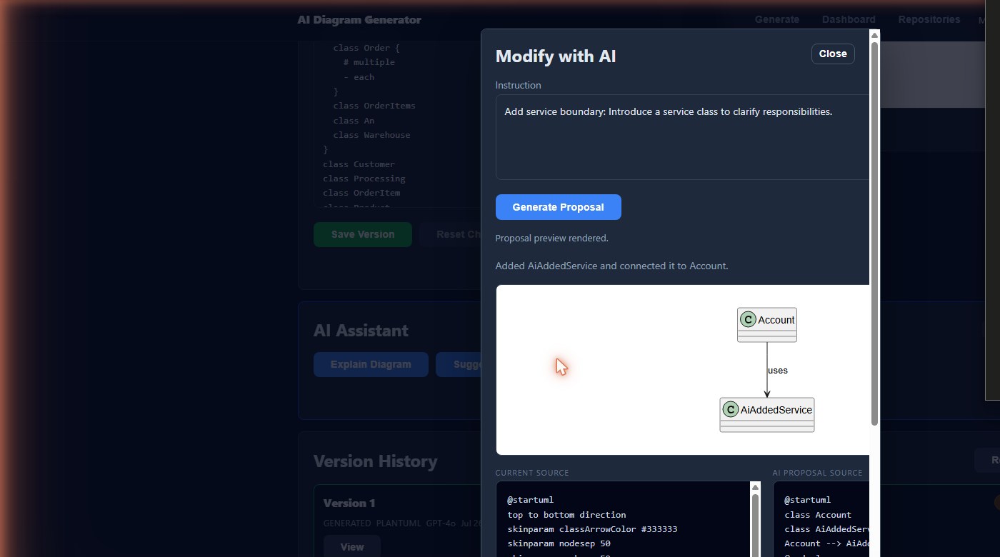
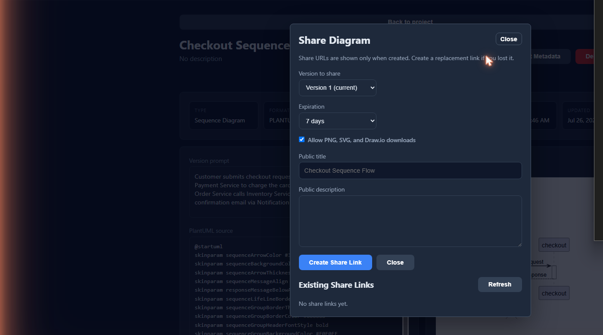
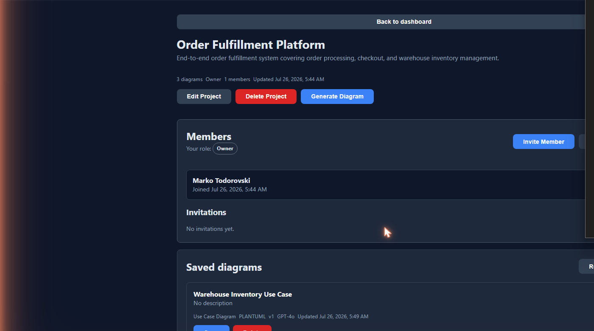
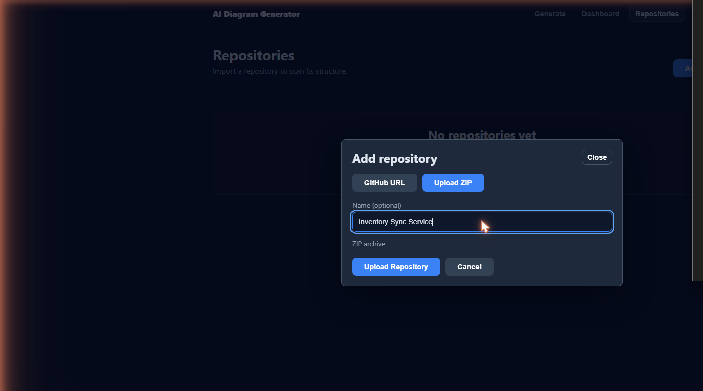

# AI Diagram Generator

[](https://www.oracle.com/java/)
[](https://spring.io/projects/spring-boot)
[](https://github.com/marko-todorovski/marko-todorovski/releases/tag/v3.0.3)
[](https://opensource.org/licenses/MIT)

> **Capstone / Diploma Project**: Automatic Generation of Software Engineering Diagrams from Natural Language, XML, and Repository Analysis

**🚀 Live demo:** [https://ai-diagrams-app.onrender.com/](https://ai-diagrams-app.onrender.com/) — hosted on Render's free tier, so the app spins down after inactivity; the first request after idle can take 30–50s to wake up. Note: AI Assistant (Explain/Suggest/Modify) features require an OpenAI API key, which is not configured on this deployment, so those features currently fall back to "unavailable"; diagram generation itself works fully via the rule-based/NLP engine.

A full-stack Spring Boot application that generates, edits, versions, shares, and collaborates on software engineering diagrams (Mermaid / PlantUML / Draw.io formats). Includes session-based authentication, a project dashboard, an in-browser diagram editor, AI-assisted editing, public sharing, team workspaces, and automated repository analysis.

## Tech Stack

| Layer | Technology |
|---|---|
| Backend | Java 21, Spring Boot 4, Spring Security, Spring Data JPA |
| Frontend | React 18 (in-browser Babel/JSX, no build step) |
| Database | PostgreSQL (production), H2 (development) |
| Migrations | Flyway |
| Diagram formats | Mermaid, PlantUML, Draw.io |
| AI integration | Pluggable LLM interface (OpenAI / Claude / Ollama-ready) |
| API docs | OpenAPI / Swagger UI |

## Features

- **Authentication & security** — session-based auth with Spring Security, ownership-aware access control
- **Project dashboard** — create and manage diagram projects from a central workspace
- **Diagram editor** — in-browser editing of generated Mermaid/PlantUML code with live preview
- **Version history** — every save is tracked; browse and restore prior versions of a diagram
- **AI-assisted editing** — refine existing diagrams via natural-language instructions to an LLM
- **Public sharing** — generate secure, token-based public links so diagrams can be viewed without an account
- **Team collaboration** — project membership with roles (owner/editor/viewer) and email-based invitations
- **Repository analysis** — import a GitHub repo (or ZIP), detect languages, and scan structure as a foundation for diagram generation
- **Diagram generation** from natural language, XML, and repository URLs (Class, Sequence, ER, Architecture, C4 Context, and more)
- **Human evaluation framework** — clarity, correctness, and usefulness scoring per generated diagram
- **Database persistence** with Flyway migrations (H2 for dev, PostgreSQL for production)

## Quick Start

### Prerequisites

- Java 21+
- Maven 3.6+ (or use the bundled `./mvnw`)
- (Optional) PostgreSQL for production

### Run

```bash
# Development mode (H2 in-memory database)
./mvnw spring-boot:run -Dspring-boot.run.profiles=dev

# Production mode (PostgreSQL required)
./mvnw spring-boot:run
```

### Access Points

| Service | URL |
|---|---|
| **App** | http://localhost:8080/ |
| **Swagger UI** | http://localhost:8080/swagger-ui.html |
| **API Docs** | http://localhost:8080/api-docs |
| **H2 Console** | http://localhost:8080/h2-console (dev only) |

## Architecture

Layered Spring Boot backend (Controller → Service → Repository → Database) with a modular JSX-based static frontend, no build step required.

```
┌──────────────────────────────────────────────────────────────┐
│  Browser (React 18, in-browser Babel)                        │
│  auth · dashboard · editor · ai-assistant · sharing ·         │
│  collaboration · repositories                                │
└───────────────────────────┬────────────────────────────────────┘
                            │ REST / JSON (session cookie auth)
┌───────────────────────────▼────────────────────────────────────┐
│  Controller Layer                                              │
│  Diagram · Auth · Project · ProjectCollaboration ·             │
│  ProjectInvitation · DiagramVersion · DiagramShare ·            │
│  Repository · RepositoryScan · DiagramAiAssistant               │
└───────────────────────────┬────────────────────────────────────┘
                            │
┌───────────────────────────▼────────────────────────────────────┐
│  Service Layer                                                 │
│  business logic, permission checks, LLM integration point       │
└───────────────────────────┬────────────────────────────────────┘
                            │
┌───────────────────────────▼────────────────────────────────────┐
│  Repository Layer (Spring Data JPA)                            │
└───────────────────────────┬────────────────────────────────────┘
                            │
┌───────────────────────────▼────────────────────────────────────┐
│  Database (PostgreSQL / H2), Flyway-migrated                    │
└──────────────────────────────────────────────────────────────┘
```

```
src/main/java/com/example/aidiagramgenerator/
├── controller/    # REST endpoints: diagrams, auth, projects, workspaces,
│                  #   invitations, sharing, versions, repositories, AI assistant
├── service/       # Business logic, incl. LLM integration points
├── domain/        # JPA entities (Diagram, Project, ProjectMember, Repository, ...)
├── dto/           # Request/response DTOs
├── repository/    # Spring Data JPA repositories
└── exception/     # Centralized exception handling

src/main/resources/
├── db/migration/  # Flyway migrations (h2/ and postgresql/)
└── static/js/     # Modular frontend (auth, editor, projects, repositories,
                   #   collaboration, sharing, ai-assistant, routing)
```

## Screenshots

| | |
|---|---|
| **Landing Page** |  |
| **Dashboard** |  |
| **Diagram Editor** |  |
| **AI Assistant** |  |
| **Public Share Page** |  |
| **Collaboration / Members** |  |
| **Repository Analysis** |  |

## Demo

[📹 Watch the full demo video](docs/video/demo.mp4)

Full walkthrough: landing → generate diagram → save to project → open editor → version history → AI-assisted edit → share link → collaboration → repository analysis.

## Project Timeline

| Version | Milestone |
|---|---|
| v1.0.0 | Diagram persistence, generation from text/XML/URL |
| v2.0.0 | Session authentication and security foundation |
| v3.0.0 | Frontend dashboard, editor, version history, AI-assisted editing, public sharing, team workspaces, repository analysis |
| v3.0.2 | Release-prep: demo screenshots/video, production deployment checklist, CHECK-constraint bugs verified fixed against real PostgreSQL |
| v3.0.3 | Live production deployment on Render (PostgreSQL + Docker), Graphviz/PlantUML rendering fix, full smoke-test pass of auth/projects/editor/versioning/sharing/collaboration/repository-analysis |

See `git log --oneline --decorate` for the full commit history.

## Testing

```bash
./mvnw test
```

## License

MIT
