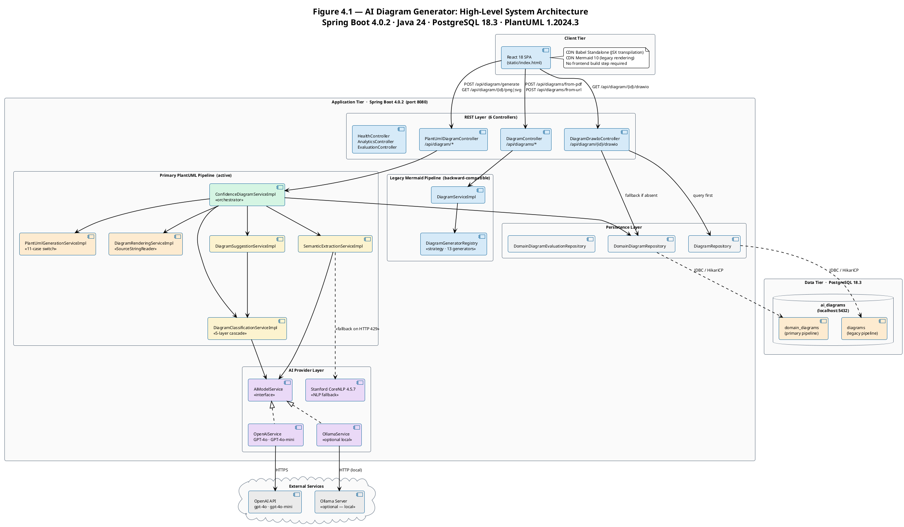
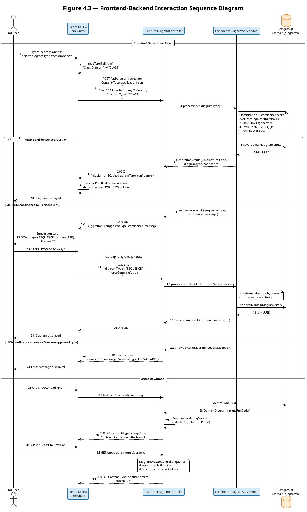
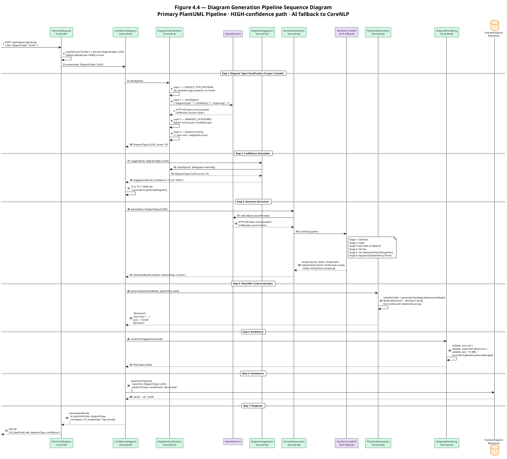
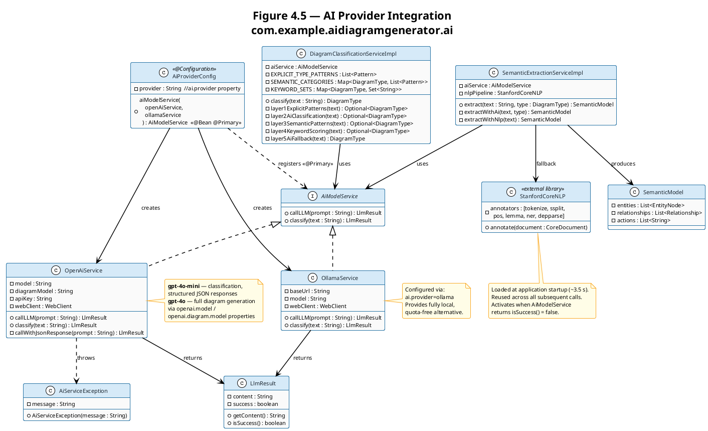
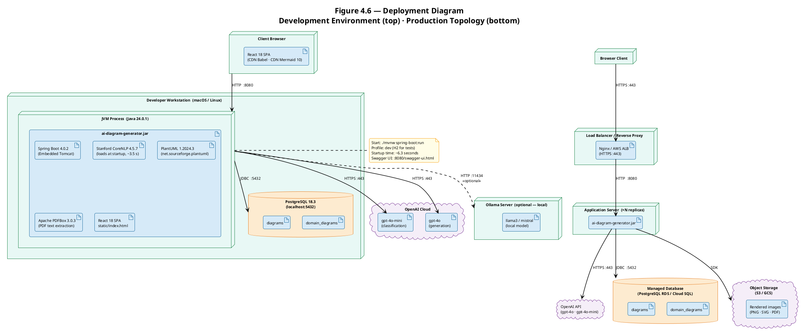
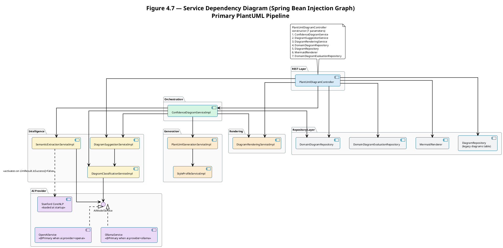
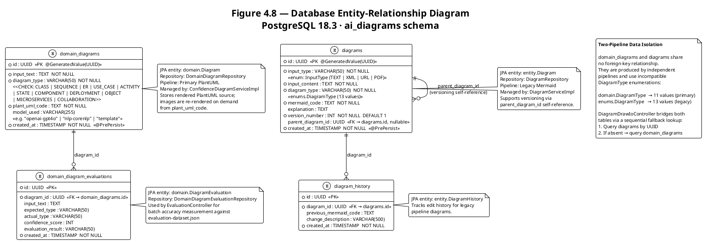

# AI Diagram Generator — UML Architecture Diagrams
### Chapter 4 Figures — PlantUML Source

All component names, class names, field names, and package structures correspond directly
to the production source code in `src/main/java/com/example/aidiagramgenerator/`.

> **Rendering:** Paste any `@startuml` … `@enduml` block into
> [plantuml.com/plantuml/uml](https://www.plantuml.com/plantuml/uml)
> or run `java -jar plantuml.jar THESIS_DIAGRAMS.md` with PlantUML 1.2024.3+.

---

## Figure 4.1 — High-Level System Architecture

Presents the three-tier architecture (Client · Application · Data) showing both the primary
PlantUML pipeline and the legacy Mermaid pipeline, together with their external AI service
dependencies. The dashed fallback arrow from `SemanticExtractionServiceImpl` to
`Stanford CoreNLP` activates whenever the OpenAI API returns an error or quota-exceeded response.

---

## Figure 4.2 — Backend Component Diagram

Details all packages within the Spring Boot application tier. The dashed note on
`DiagramGeneratorRegistry` marks it as unreachable dead code in the primary pipeline:
the registry auto-discovers thirteen generators at startup but is never called by
`PlantUmlGenerationServiceImpl`, which performs all generation via an inline switch.

```plantuml
@startuml Figure_4_2_Backend_Components

!theme plain
skinparam backgroundColor white
skinparam defaultFontName Arial
skinparam defaultFontSize 10
skinparam shadowing false
skinparam roundcorner 6
skinparam arrowThickness 1.2
skinparam packageStyle rectangle
skinparam package {
  BackgroundColor #FEFEFE
  BorderColor #7F8C8D
  FontStyle bold
}
skinparam component {
  BorderColor #2471A3
  FontSize 10
}

title Figure 4.2 — Backend Component Diagram\ncom.example.aidiagramgenerator

package "controller" {
  [PlantUmlDiagramController] as C1 #D6EAF8
  [DiagramController] as C2 #D6EAF8
  [DiagramDrawIoController] as C3 #D6EAF8
  [AnalyticsController] as C4 #D6EAF8
  [EvaluationController] as C5 #D6EAF8
  [HealthController] as C6 #D6EAF8
}

package "service  (orchestration)" {
  [ConfidenceDiagramService\n<<interface>>] as SVC_CONF
  [ConfidenceDiagramServiceImpl] as CDS #D5F5E3
  [MermaidRenderer\n<<interface>>] as SVC_MR
}

package "service  (intelligence)" {
  [DiagramClassificationService\n<<interface>>] as SVC_CLASS
  [DiagramClassificationServiceImpl] as CLASS_IMPL #FCF3CF
  [DiagramSuggestionService\n<<interface>>] as SVC_SUGG
  [DiagramSuggestionServiceImpl] as SUGG_IMPL #FCF3CF
  [SemanticExtractionService\n<<interface>>] as SVC_EXT
  [SemanticExtractionServiceImpl] as EXT_IMPL #FCF3CF
}

package "service  (generation)" {
  [PlantUmlGenerationService\n<<interface>>] as SVC_GEN
  [PlantUmlGenerationServiceImpl] as GEN_IMPL #FDEBD0
  note bottom of GEN_IMPL
    11-case switch (CLASS, SEQUENCE, ER,
    USE_CASE, COMPONENT, DEPLOYMENT,
    ACTIVITY, STATE, OBJECT,
    MICROSERVICES, COLLABORATION)
    Switch duplicated in two overloads.
  end note
}

package "service  (generation  — dead code)" {
  [ActivityDiagramGeneratorServiceImpl] as DEAD1 #F5B7B1
  [CollaborationDiagramGeneratorServiceImpl] as DEAD2 #F5B7B1
  [ComponentDiagramGeneratorServiceImpl] as DEAD3 #F5B7B1
  [DeploymentDiagramGeneratorServiceImpl] as DEAD4 #F5B7B1
  [ObjectDiagramGeneratorServiceImpl] as DEAD5 #F5B7B1
  [StateDiagramGeneratorServiceImpl] as DEAD6 #F5B7B1
  note top of DEAD1
    <<dead code>>
    Compiled but never injected.
    Abandoned refactoring artefacts.
  end note
}

package "service/render" {
  [DiagramRenderingService\n<<interface>>] as SVC_REND
  [DiagramRenderingServiceImpl] as REND_IMPL #FDEBD0
}

package "service/generation  (legacy strategy)" {
  [DiagramGenerator\n<<interface>>] as GEN_IFACE
  [DiagramGeneratorRegistry] as REGISTRY #F9E79F
  [ClassDiagramGenerator] as GEN_CLS
  [SequenceDiagramGenerator] as GEN_SEQ
  [ErDiagramGenerator ... +10] as GEN_OTHERS
  note bottom of REGISTRY
    <<unused by primary pipeline>>
    Auto-discovers 13 generators
    via Spring injection.
    Never called by
    PlantUmlGenerationServiceImpl.
  end note
}

package "ai" {
  [AiModelService\n<<interface>>] as AI_IFACE #EAD9F7
  [OpenAiService] as OPENAI #EAD9F7
  [OllamaService] as OLLAMA #EAD9F7
  [LlmResult] as LLM_RES
  [AiServiceException] as AI_EX
}

package "config" {
  [AiProviderConfig\n<<@Configuration>>] as AI_CFG #EAD9F7
  note right of AI_CFG
    Reads ai.provider property.
    Registers OpenAiService or
    OllamaService as @Primary.
  end note
}

package "exception" {
  [GlobalExceptionHandler\n<<@ControllerAdvice>>] as GEX #F9E79F
  [InvalidDiagramRequestException] as EX_INV
  [DiagramNotFoundException] as EX_NF
  [DiagramGenerationException] as EX_GEN
}

package "repository" {
  [DomainDiagramRepository] as R_DOM #F2F3F4
  [DiagramRepository] as R_LEG #F2F3F4
  [DomainDiagramEvaluationRepository] as R_EVAL #F2F3F4
}

package "dto/request" {
  [GenerationRequest\n(@JsonAlias text|description|inputText)] as DTO_GEN
  [EvaluationRequest] as DTO_EVAL
}

package "domain" {
  [Diagram\n@Table(domain_diagrams)] as DOM_DIAG
  [DiagramType\n<<enum · 11 values>>] as DOM_TYPE
  [SemanticModel] as SEM_MOD
  [StyleProfile] as STYLE
  [LayoutProfile] as LAYOUT
}

package "entity" {
  [Diagram\n@Table(diagrams)] as ENT_DIAG
}

package "enums" {
  [DiagramType\n<<enum · 13 values>>] as ENUM_TYPE
  note right of ENUM_TYPE
    Incompatible with domain.DiagramType.
    Adds ARCHITECTURE and C4_CONTEXT.
    Used exclusively by legacy pipeline.
  end note
}

' Interfaces
SVC_CONF <|.. CDS
SVC_CLASS <|.. CLASS_IMPL
SVC_SUGG <|.. SUGG_IMPL
SVC_EXT <|.. EXT_IMPL
SVC_GEN <|.. GEN_IMPL
SVC_REND <|.. REND_IMPL
AI_IFACE <|.. OPENAI
AI_IFACE <|.. OLLAMA
GEN_IFACE <|.. GEN_CLS
GEN_IFACE <|.. GEN_SEQ
GEN_IFACE <|.. GEN_OTHERS

' Controller wiring
C1 --> CDS
C1 --> SVC_SUGG
C1 --> SVC_REND
C1 --> R_DOM
C1 --> R_LEG
C1 --> SVC_MR
C1 --> R_EVAL
C2 --> REGISTRY
C3 --> R_LEG
C3 --> R_DOM

' Primary pipeline wiring
CDS --> CLASS_IMPL
CDS --> SUGG_IMPL
CDS --> EXT_IMPL
CDS --> GEN_IMPL
CDS --> REND_IMPL
CDS --> R_DOM
SUGG_IMPL --> CLASS_IMPL
CLASS_IMPL --> AI_IFACE
EXT_IMPL --> AI_IFACE
EXT_IMPL ..> [Stanford CoreNLP\n<<NLP fallback>>] : activate on failure

' Generation
GEN_IMPL --> SEM_MOD
GEN_IMPL --> DOM_TYPE

' Legacy
REGISTRY --> GEN_IFACE

' Config
AI_CFG --> OPENAI
AI_CFG --> OLLAMA

' Data
R_DOM --> DOM_DIAG
R_LEG --> ENT_DIAG

@enduml
```

---

## Figure 4.3 — Frontend–Backend Interaction Sequence Diagram

Illustrates the complete client–server interaction for a standard diagram generation request,
including the MEDIUM-confidence suggestion branch (where the system returns a suggestion
card and waits for user confirmation before generating) and the subsequent asset download flow.

---

## Figure 4.4 — Diagram Generation Pipeline Sequence Diagram

Illustrates the complete internal processing sequence of the primary PlantUML pipeline
for a request that reaches the HIGH-confidence generation path. The diagram shows the
five-layer classification cascade partially failing at the AI layer (HTTP 429 quota-exceeded),
the system recovering through keyword scoring (Layer 4), semantic extraction falling back
to Stanford CoreNLP, and the complete generation-through-persistence sequence.

---

## Figure 4.5 — AI Provider Integration Class Diagram

Shows the `AiModelService` abstraction layer, its two concrete implementations, the
`AiProviderConfig` factory, and all service classes that depend on the interface.
`SemanticExtractionServiceImpl` carries an additional dependency on `StanfordCoreNLP`,
activated as a fallback whenever `LlmResult.isSuccess()` returns false.

---

## Figure 4.6 — Deployment Diagram

Documents the physical and logical deployment topology for both the development environment
(single developer workstation) and the recommended production topology (load-balanced
multi-replica deployment with managed database and object storage).

---

## Figure 4.7 — Service Dependency Diagram

Shows the Spring bean injection graph for the primary PlantUML pipeline. Each arrow
represents a constructor-injected dependency. The controller's seven constructor parameters
are shown explicitly. Dead-code service beans (those defined but never injected anywhere)
are excluded; they are documented in Figure 4.2.

---

## Figure 4.8 — Database Entity-Relationship Diagram

Documents the relational schema of both tables. The two tables share no foreign-key
relationship; they are produced by two independent pipelines and are queried together
only by `DiagramDrawIoController`, which applies a sequential fallback lookup.
The `parent_diagram_id` column in the `diagrams` table is a nullable self-referencing
foreign key supporting diagram versioning within the legacy pipeline.

---

## Rendering Notes

| Diagram | Type | Key UML Notation |
|---|---|---|
| Figure 4.1 | Component / Package | `[Component]`, `package`, `cloud`, `database` |
| Figure 4.2 | Component | `[Component]`, `<\|..` (realization), `package` |
| Figure 4.3 | Sequence | `actor`, `participant`, `alt/else/end`, `autonumber` |
| Figure 4.4 | Sequence | `participant`, `database`, `==`, `note`, `autonumber` |
| Figure 4.5 | Class | `interface`, `class`, `<\|..`, `-->`, `..>` |
| Figure 4.6 | Deployment | `node`, `artifact`, `database`, `cloud` |
| Figure 4.7 | Component | `[Component]`, `interface`, `package`, `..>` |
| Figure 4.8 | Entity-Relationship | `entity`, `\|\|--o{` (one-to-many), `note` |

All diagrams use `!theme plain` with explicit `skinparam` directives to produce clean,
print-quality output suitable for thesis documentation.
